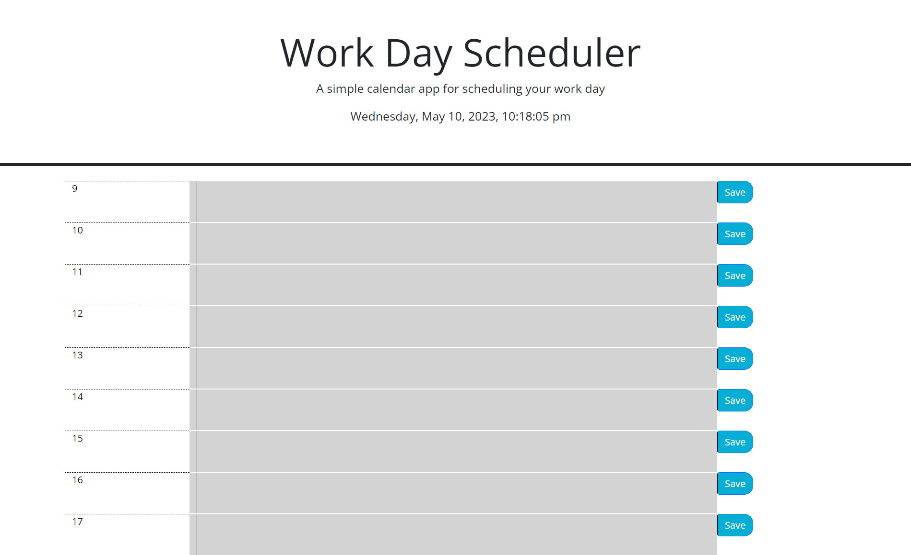

# 05 Third-Party APIs: Work Day Scheduler

## Your Task

Create a simple calendar application that allows a user to save events for each hour of the day by modifying starter code. This app will run in the browser and feature dynamically updated HTML and CSS powered by jQuery.

You'll need to use the [Day.js](https://day.js.org/en/) library to work with date and time. Be sure to read the documentation carefully and concentrate on using Day.js in the browser.

## User Story

```md
AS AN employee with a busy schedule
I WANT to add important events to a daily planner
SO THAT I can manage my time effectively
```

## Acceptance Criteria

```md
GIVEN I am using a daily planner to create a schedule
WHEN I open the planner
THEN the current day is displayed at the top of the calendar
WHEN I scroll down
THEN I am presented with timeblocks for standard business hours
WHEN I view the timeblocks for that day
THEN each timeblock is color coded to indicate whether it is in the past, present, or future
WHEN I click into a timeblock
THEN I can enter an event
WHEN I click the save button for that timeblock
THEN the text for that event is saved in local storage
WHEN I refresh the page
THEN the saved events persist
```

## Methodology

I started by creating a current day and time interval using dayjs's formatting. From there, I dynamically created timeslots that take your input
from when you want your day to start to the end of your working day, but for this example I've done the standard working day. I created an interval which
updates the timeblocks every 10 minutes to keep the scheduler up to date. I created a save function which saves the taska nd hour into local storage to
be retrieved later. Finally, I created an initialisation function which runs the other functions when the page is opened.

## Links

GitHub Repo: https://github.com/Tiernan-97/Work-Day-Scheduler
Live Page: https://tiernan-97.github.io/Work-Day-Scheduler/

## Screenshot

</img>